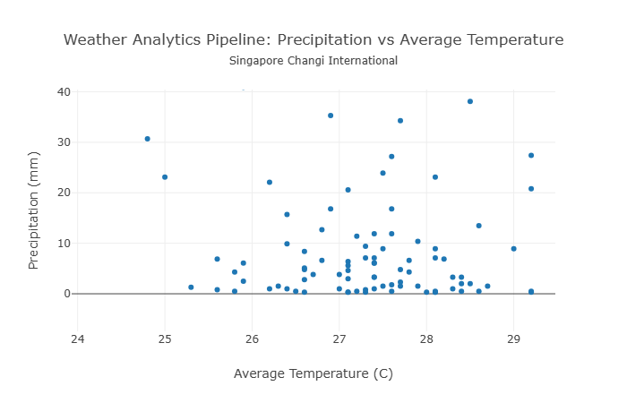

# Weather Analytics ELT Pipeline

## Project Overview
This data engineering project builds an end-to-end ELT (Extract, Load, Transform) pipeline using AWS services to collect, process, and analyze weather data from the NOAA Climate Data Online API. The primary focus is investigating the relationship between precipitation intensity and temperature in Singapore through real-time data analysis.

## Architecture

### NOAA API → AWS Lambda → S3 → Redshift

### Data Flow
1. **Extract**: AWS Lambda function fetches daily weather data from NOAA API (daily at 9:00 AM)
2. **Load**: Raw data is stored in Amazon S3 buckets
3. **Transform**: Data is loaded into Amazon Redshift via COPY command (daily at 10:00 AM)
4. **Analyze**: SQL transformations create views for precipitation and temperature analysis

## Technical Components

### Extraction & Loading
- **Data Source**: NOAA Climate Data Online (CDO) Web API
- **Parameters**: Temperature (avg, min, max), precipitation, wind speed
- **Scheduling**: Daily extraction at 9:00 AM using CloudWatch Events
- **Storage**: Raw CSV files in S3 (`pyh-data-project-bucket/raw_weather/`)
- **Redshift Loading**: Automated COPY command scheduled daily at 10:00 AM

### Transformation
- **Data Modeling**: SQL views in Redshift for:
  - Joining weather measurements with station and datatype metadata
  - Filtering records for Singapore Changi International Airport
  - Pivoting measurements to create analysis-ready datasets
- **Key Metrics**: Daily precipitation (mm) and average temperature (°C)

### Analysis
- **Research Question**: Is precipitation intensity associated with temperature patterns?
- **Approach**: SQL-based correlation analysis to identify weather patterns
- **Insights**: Testing thesis of precipitation intensity association with temperature

## Repository Contents
- `/lambda`: AWS Lambda code for extracting NOAA API data
- `/redshift`: SQL transformation logic
- `/s3`: Extracted data
